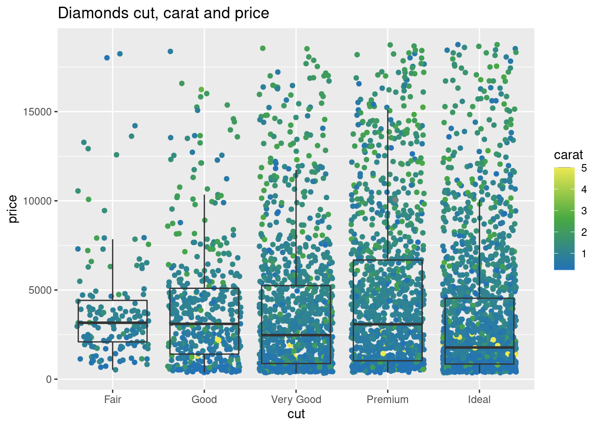
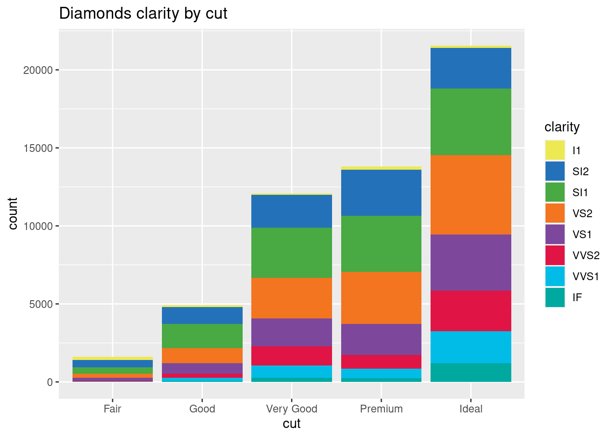
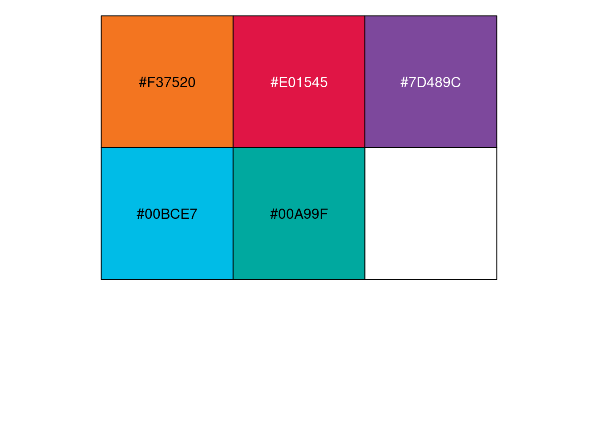
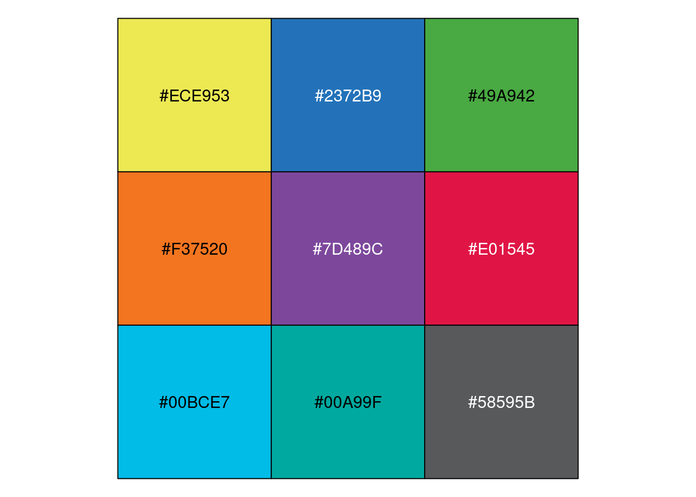
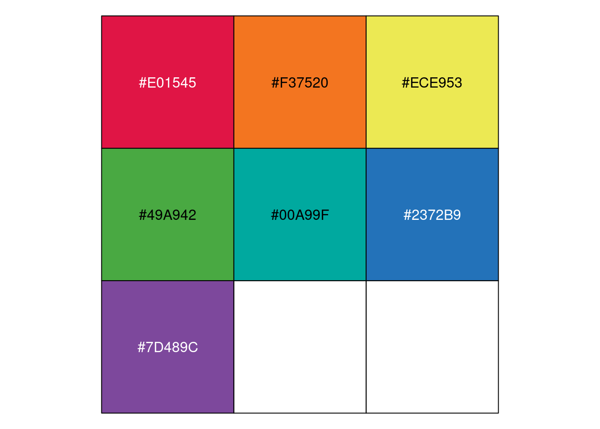
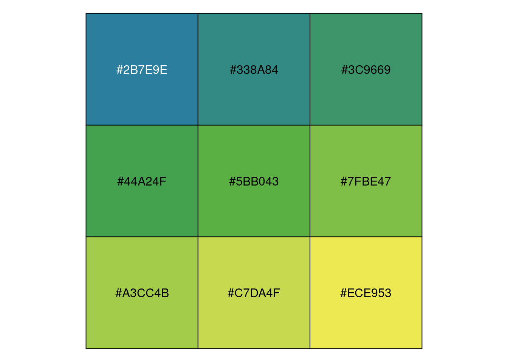
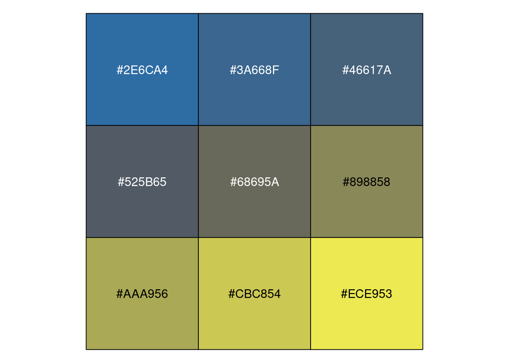

<!-- README.md is generated from README.Rmd. Please edit that file -->

## `ggwehi`: Colour scales for `ggplot2` based on the WEHI colour palette

### Examples

``` r
library(tidyverse)
library(ggwehi)
set.seed(1)
diamonds %>% 
  sample_n(5000) %>% 
  ggplot(aes(x = cut, y = price, col = carat)) +
  geom_jitter(height = 0) + 
  geom_boxplot(fill = NA, outlier.colour = NA) +
  scale_colour_wehi_continuous() +
  ggtitle('Diamonds cut, carat and price')
```



``` r
diamonds %>% 
  ggplot(aes(x = cut, fill = clarity)) +
  geom_bar() +
  scale_fill_wehi() +
  ggtitle('Diamonds clarity by cut')
```



### Scale functions

  - `scale_fill_wehi`
  - `scale_colour_wehi`
  - `scale_fill_wehi_ordered`
  - `scale_colour_wehi_ordered`
  - `scale_fill_wehi_continuous`
  - `scale_fill_wehi_continuous_c`
  - `scale_colour_wehi_continuous`
  - `scale_color_wehi_continuous_c`

### Palettes

``` r
scales::show_col(ggwehi::wehi_primary)
```


``` r
scales::show_col(ggwehi::wehi_secondary)
```



``` r
scales::show_col(ggwehi::wehi_extended)
```



``` r
scales::show_col(ggwehi::wehi_ordered)
```



``` r
scales::show_col(ggwehi:::wehi_continous()(seq(0,1,1/9)))
```



``` r
scales::show_col(ggwehi:::wehi_continous_c()(seq(0,1,1/9)))
```


