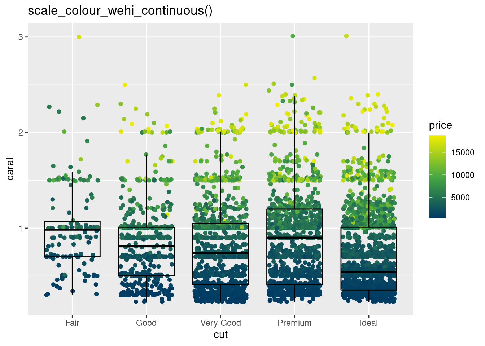
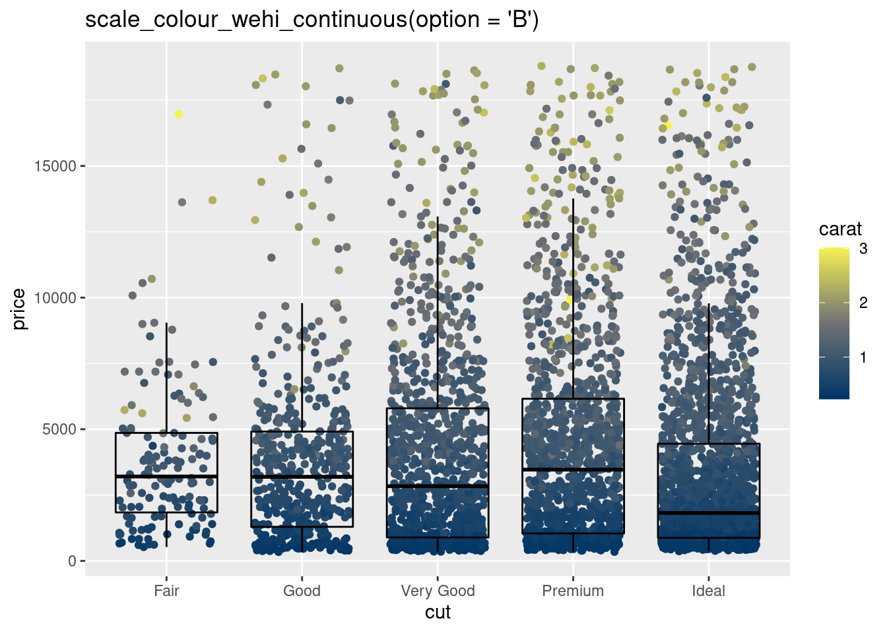
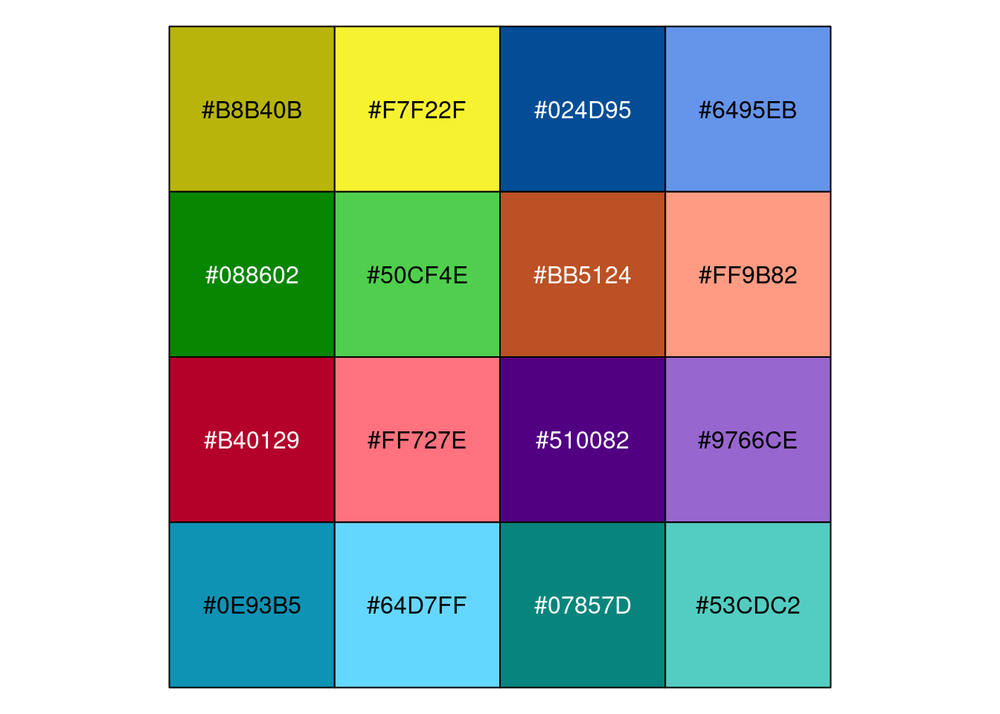
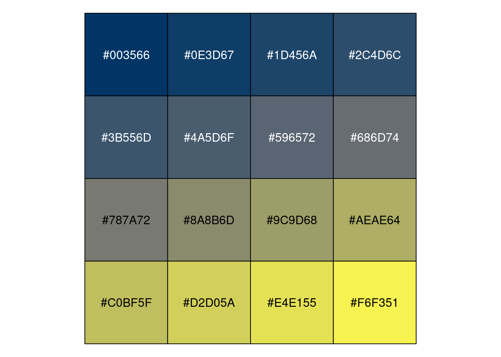

<!-- README.md is generated from README.Rmd. Please edit that file -->

## `ggwehi`: Colour scales for `ggplot2` based on the WEHI colour palette

### Installation

``` r
devtools::install_github("jemunro/ggwehi")
```

### Examples

``` r
library(tidyverse)
library(ggwehi)

diamonds %>% 
  ggplot(aes(x = cut, fill = clarity)) +
  geom_bar() +
  scale_fill_wehi() +
  ggtitle('scale_fill_wehi()')
```


``` r
set.seed(1)
tibble(class_condition = c(rbind(str_c(1:5, 'A'), str_c(1:5, 'B'))),
       class = str_extract(class_condition, '^.'),
       condition = str_extract(class_condition, '.$'),
       value = abs(rnorm(length(class)))) %>% 
  ggplot(aes(class, value, fill = class_condition)) +
  geom_col() +
  scale_fill_wehi_paired() +
  ggtitle('scale_fill_wehi_paired()')
```


``` r
set.seed(2)
diamonds %>% 
  sample_n(5000) %>% 
  ggplot(aes(x = cut, y = price, col = carat)) +
  geom_jitter(height = 0, width = 0.35) + 
  geom_boxplot(fill = NA, outlier.colour = NA, col = 'black') +
  scale_colour_wehi_continuous() +
  ggtitle('scale_colour_wehi_continuous()')
```



``` r
set.seed(2)
diamonds %>% 
  sample_n(5000) %>% 
  ggplot(aes(x = cut, y = price, col = carat)) +
  geom_jitter(height = 0, width = 0.35) + 
  geom_boxplot(fill = NA, outlier.colour = NA, col = 'black') +
  scale_colour_wehi_continuous(option = 'B') +
  ggtitle('scale_colour_wehi_continuous(option = \'B\')')
```



### Scale functions

  - `scale_fill_wehi()`/`scale_colour_wehi()`
  - `scale_fill_wehi_paired()`/`scale_colour_wehi_paired()`
      - Note: This will only work if the aesthetic is such that when
        alphabetically sorted the pairs are adjacent to one another, and
        all pairs are complete. For a more general solution use
        `scale_fill_manual(values = x)` where x is a named vector of
        values from ggwehi::wehi\_paired.
  - `scale_fill_wehi_ordered()`/`scale_colour_wehi_ordered()`
  - `scale_fill_wehi_continuous()`/`scale_colour_wehi_continuous()`
      - Note: `scale_fill_wehi_continuous(option = 'B')` provides a
        scale that is better perceived in grayscale and with various
        forms of colour blindness, similar to
        `scale_fill_viridis_c(option = 'E')`

### Palettes

``` r
scales::show_col(wehi_primary)
```


``` r
scales::show_col(wehi_secondary)
```


``` r
scales::show_col(wehi_extended)
```


``` r
scales::show_col(wehi_ordered)
```



``` r
scales::show_col(wehi_paired)
```


``` r
scales::show_col(wehi_continous_a()(seq(0,1,1/15)))
```


``` r
scales::show_col(wehi_continous_b()(seq(0,1,1/15)))
```


